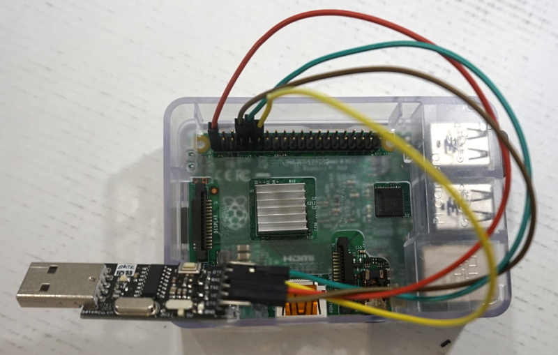
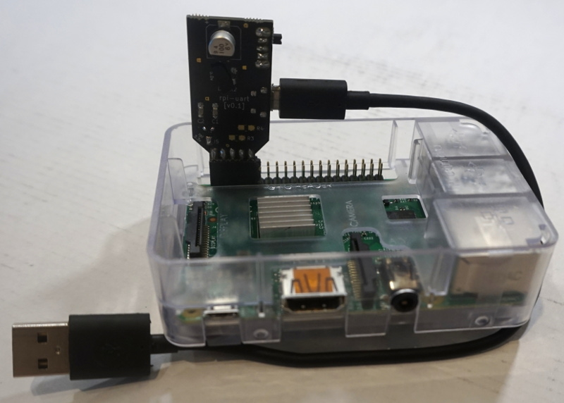
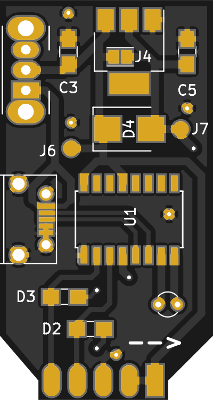
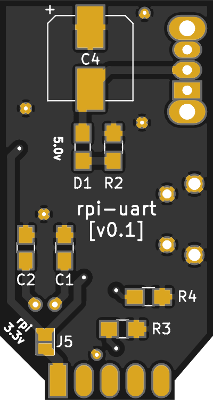
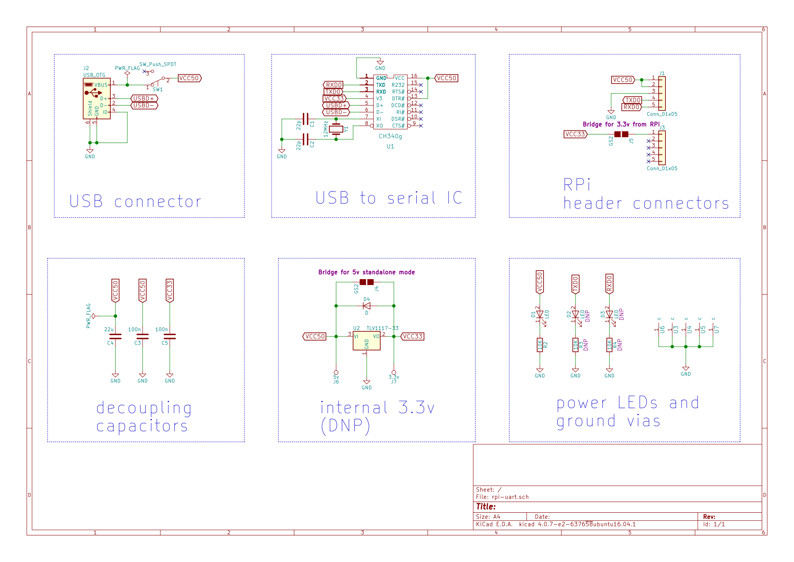

rpi-uart
========

This is a serial interface board for the Raspberry Pi. It lets you to power and talk to the board using only a micro-USB cable. Hence you can go from this mess

. . . to this:

To me the main advantage of this is that I can quickly move it between different boards.

Open hardware
-------------

The PCB was developed using KiCad and is published under the CERN Open Hardware License v1.2.

Some footprints have been modified to eliminate oval plated holes which may be expensive to manufacture.
I have also tried to make the design easy to solder, although you still may find the fine-pitche USB connector a bit challenging.
The CH340g IC was chosen to avoid depending on FTDI or counterfeit FTDI.

You can order the bare PCB from pcbs.io using
`this link <https://pcbs.io/order/08043673da1c775680bd1953e54f6a0dae2b9cd861ef7ed70277be7d07e429cb>`_.
They provide 4 boards of good quality for $5.20 including shipping:

    

    

Operations modes
----------------

The board can be populated in a couple of ways to allow different powering modes.
Only one of which will not fry your Raspberry Pi so pay attention to this!

RPi mode
~~~~~~~~

To connect directly to a Raspberry Pi you should populate the following components::

     component |          type          | notes
    ========================================================
     J2        | micro USB connector    |
     U1        | CH340g                 |
     Y1        | 12MHz crystal          |
     C1,C2     | 22pF 0805 SMD caps     | probably optional
     R2        | 10K 0805 SMD resistor  | optional
     D1        | 0805 LED               | optional
     J5        | solder bridge          | bridge
     J4        | solder bridge          | MUST BE OPEN

If you want to power it from the same cable, you will also need these::

     component |          type          | notes
    ========================================================
     C4        | 22u SMD cap            |
     SW1       | Switch                 | or bridge 1-2 for permanent power

Full 5.0v mode
~~~~~~~~~~~~~~~

If you are using this as a stand-alone USB-to-serial converter and WITHOUT a raspberry pi 
and want to have 5.0v transmit and receive signals you will need to bridge the 5.0 and 3.3 rails::

     component |          type          | notes
    ========================================================
     J5        | solder bridge          | MUST BE OPEN
     J4        | solder bridge          | bridge

Local 3.3v mode
~~~~~~~~~~~~~~~

If you instead want to use a locally generated 3.3v::

     component |          type          | notes
    ========================================================
     J5        | solder bridge          | MUST BE OPEN
     J4        | solder bridge          | MUST BE OPEN
     U2        | 3.3v SMD regulator     |
     C3, C5    | 100n 0805 SMD caps     |

Remaining components
~~~~~~~~~~~~~~~~~~~~

The following components are not needed and should not be populated::

     component |          type          | notes
    ========================================================
     D4        | protection SMD didoe   | protection for cheap regulators
     R3, R4    | 10K 0805 SMD resistors | for RX/TX LED
     D2, D3    | 10805 SMD LEDs         | RX/TX LED

